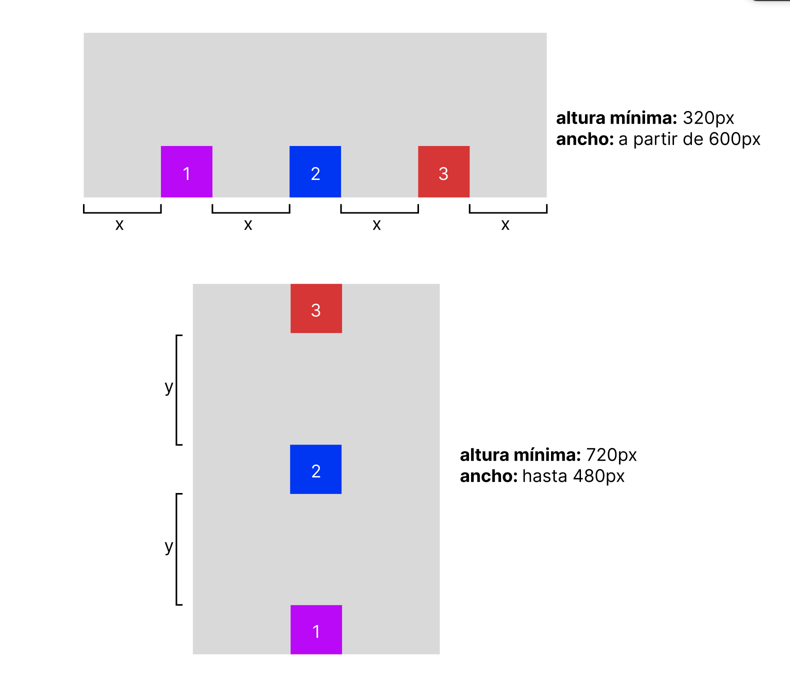

# Examen Extraordinario de Lenguajes de Marcas

Este examen consta de dos partes:
- **[Parte 1:](#parte-1)** HTML básico, CSS básico, 
- **[Parte 2:](#parte-2)** Flexbox, CSS Grid, Transiciones CSS, Animaciones CSS, Transformaciones CSS 

Se valorará positivamente:
- Que el html tenga title, clases e ids descriptivos
- El uso de selectores CSS avanzados
- El uso de comentarios para organizar el CSS
- La indentación y la presentación 
- El orden y estructura de las clases CSS
- Que el resultado se parezca visualmente a los diseños propuestos

Se penalizará:
- El uso inapropiado de las clases y los ids 
- Construcción incompleta de los documentos html (doctype, html, head, body, …)

------------------------------
## Parte 1
#### 1.1 Formulario

Realizar un formulario como el de la siguiente imagen:

**Requisitos:**
- un input para texto
- un input para números
- un input para teléfonos
- un conjunto de selectores que permitan múltiples opciones seleccionadas simultáneamente
- un botón de envío de formulario

#### 1.2 Tablas

Realizar una tabla como la siguiente

**colores:**
- mediumpurple
- aquamarine

**recomendación:** empezar por una tabla 3x3 y luego ir combinando columnas y filas.

------------------------------
## Parte 2
#### 2.1 Flexbox
Crear un contenedor flex **responsive** con 3 elementos en su interior tal y como se muestra en la siguiente imagen:

La imagen respresenta un único contenedor. En la parte superior se puede ver cómo se ha de comportar dicho contenedor con su contenido a partir de los `600px` de ancho de pantalla, y la inferior para un ancho menor de dicha cifra

##### Requisitos:
- (1pt) El contenedor (indicado en gris claro) ha de tener un **ancho máximo** de `900px` y ha de estar **centrado horizontalmente** respecto al cuerpo de la página.
- (1pt) Los elementos han de ser de 100x100px y respetar los colores mostrados en la imagen
- (1,5pt) Los elementos se han de colocar de manera horizontal (parte superior de la imagen) a partir de un ancho de pantalla de `600px`.
- (1,5pt) Los elementos se han de colocar verticalmente en orden inverso (parte inferior de la imagen) hasta un ancho de pantalla de `600px`.
- **Importante:** respetar el espaciado de los elementos reflejado en la imagen.

#### 2.2 Grid
Crear un contenedor grid con 3 elementos en su interior situados como se muestra en la siguiente imagen:

**Requisitos:**
##### (1,5pt) Contenedor:
- El contenedor ha de tener una retícula de 4 columnas (proporciones: x,x,2x,x) y 3 filas (proporciones: y,2y,y). 
- Ancho máximo del contenedor: `800px`.
- Contenedor centrado horizontalmente respecto al cuerpo de la página.

##### (2pt) Utilizar transformaciones 2d:
- (1pt)Trasladar el primer elemento 50px hacia abajo 
- (1pt)Agrandarun120%eltercerelemento

##### (1,5pt) Utilizar Animaciones:
- (0,75pt)Cambiar el color del borde de amarillo a morado:
    - Duración: dos segundos y medio
    - Modo de suavizado: lineal
    - Repetir indefinidamente alternando la dirección

- (0,75pt)Hacer rotar a los elementos pares:
    - Duración tres cuartos de segundo
    - Modo de suavizado: suavizado en entrada y salida 
    - Repetir indefinidamente
